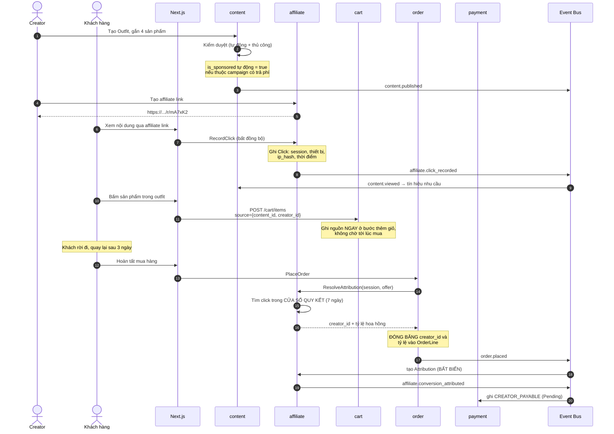
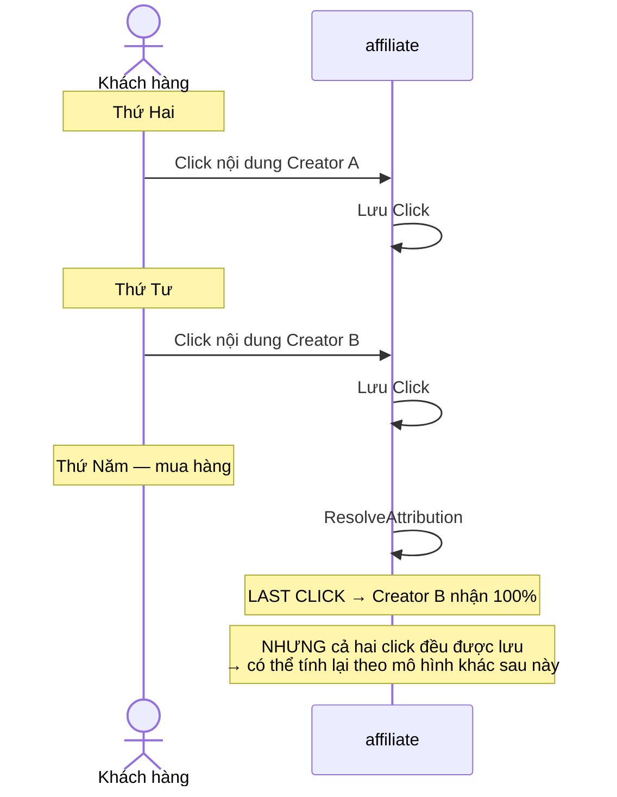
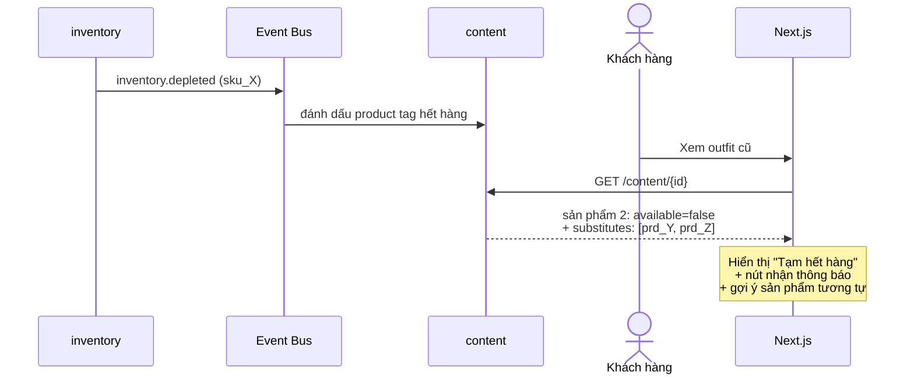
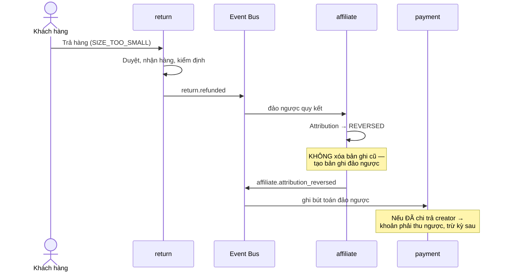
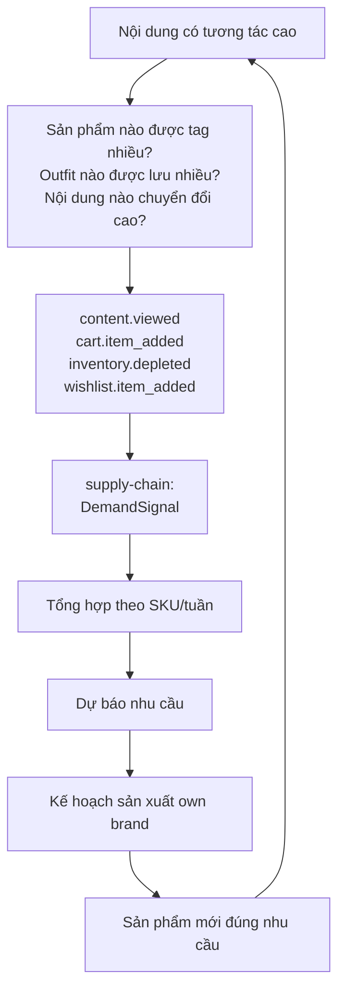

# Luồng: Thương mại qua nội dung

## 1. Tổng quan

```text
Creator tạo nội dung → Khách xem → Click → Mua → Quy kết → Hoa hồng
```

Đây là luồng tạo ra khác biệt của nền tảng so với ecommerce thông thường.

---

## 2. Sequence diagram — từ nội dung tới đơn hàng



---

## 3. Ba quyết định quan trọng trong luồng

### 3.1 Ghi nguồn ở bước thêm giỏ (bước 12)

```text
Vì sao không chỉ ghi ở lúc mua?

    - Đo được tỷ lệ "thêm giỏ" của từng nội dung,
      không chỉ tỷ lệ mua
    - Phân tích nội dung nào tạo ý định nhưng không chốt được
    - Quy kết chính xác hơn khi khách mua sau vài ngày
```

### 3.2 Cửa sổ quy kết 7 ngày (bước 16)

```text
Khách hàng thời trang KHÔNG mua ngay.
Họ xem nội dung, cân nhắc, so sánh, mua sau vài ngày.

Cửa sổ quá ngắn → không phản ánh đúng đóng góp creator
Cửa sổ quá dài  → quy kết cho creator không thực sự tạo đơn
```

### 3.3 Lưu toàn bộ chuỗi click, không chỉ click cuối

```text
Mô hình quy kết ban đầu: LAST CLICK (đơn giản, dễ giải thích)

NHƯNG: lưu TẤT CẢ click, không chỉ click được quy kết.

Vì sao: nếu sau này muốn đổi sang mô hình chia tỷ lệ,
        phải có dữ liệu lịch sử để tính lại.
        Dữ liệu quá khứ KHÔNG TẠO NGƯỢC ĐƯỢC.
```

Đây là ứng dụng nguyên tắc P14: chính sách đơn giản trước, dữ liệu đầy đủ ngay từ đầu.

---

## 4. Nhiều creator cùng chuỗi



---

## 5. Xử lý sản phẩm hết hàng trong nội dung

Nội dung sống lâu hơn sản phẩm. Video hay được xem nhiều tháng, khi sản phẩm gốc đã hết.



**Nguyên tắc:** không được để nội dung dẫn tới trang lỗi. Đó là lãng phí toàn bộ công sức tạo nội dung và tổn hại trải nghiệm.

Đồng thời, sự kiện này là **tín hiệu nhu cầu** — khách muốn mua nhưng không có hàng.

---

## 6. Đảo ngược khi hoàn hàng



**Cơ chế bảo vệ:** hoa hồng creator chỉ chuyển sang `Available` **sau khi hết hạn đổi trả** — giống số dư seller. Nhờ đó phần lớn trường hợp hoàn hàng xảy ra trước khi tiền được chi.

---

## 7. Vòng phản hồi về chuỗi cung ứng

Đây là mắt xích hoàn thành bánh đà.



**Ví dụ cụ thể:**

```text
Video thử áo khoác dạ oversize:
    50.000 lượt xem
    3.000 lượt click
    850 lượt thêm wishlist
    Sản phẩm chỉ còn size S

Tín hiệu rõ ràng:
    → nhu cầu tồn tại và lớn
    → nguồn cung không đủ
    → cần sản xuất thêm, phân bổ size đúng (nhiều M, L)
```

Nếu dữ liệu này nằm trong công cụ analytics bên thứ ba mà supply chain không truy vấn được, **bánh đà bị đứt**.

---

## 8. Chống gian lận

```text
Kiểu gian lận:
    Click ảo          → phân tích IP, thiết bị, tần suất
    Tự mua rồi hoàn   → đối chiếu định danh, tỷ lệ hoàn bất thường
    Cookie stuffing   → tỷ lệ click/hiển thị bất thường
    Nội dung sai lệch → tỷ lệ hoàn cao trên nội dung cụ thể
```

**Nguyên tắc:** phát hiện gian lận chạy **bất đồng bộ**, không nằm trong đường đi chính của việc ghi click — nếu không sẽ làm chậm trải nghiệm khách.

---

## 9. Điểm cần giám sát

| Chỉ báo | Ý nghĩa |
|---|---|
| Content-to-click rate | Nội dung có hấp dẫn không |
| Click-to-purchase rate | Nội dung có dẫn tới mua không |
| Return rate theo nội dung | Nội dung có gây hiểu nhầm không |
| Tỷ lệ quy kết bị đảo ngược | Chất lượng đơn từ creator |
| Độ trễ ghi click | < 50ms (không làm chậm chuyển hướng) |
| Tín hiệu gian lận | Theo dõi danh sách |

---

## 10. Tài liệu liên quan

- [creator-affiliate.md](creator-affiliate.md) — chi tiết quy kết
- [../01-business/content-commerce.md](../01-business/content-commerce.md)
- [../04-modules/content.md](../04-modules/content.md), [../04-modules/affiliate.md](../04-modules/affiliate.md)
