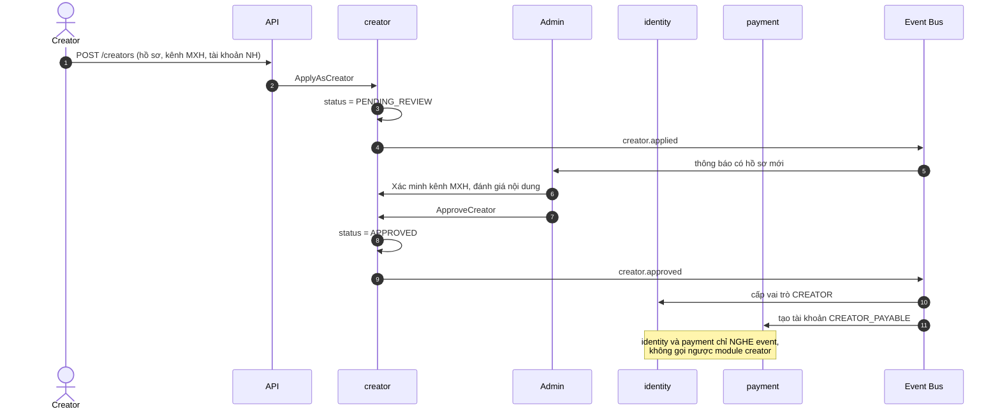
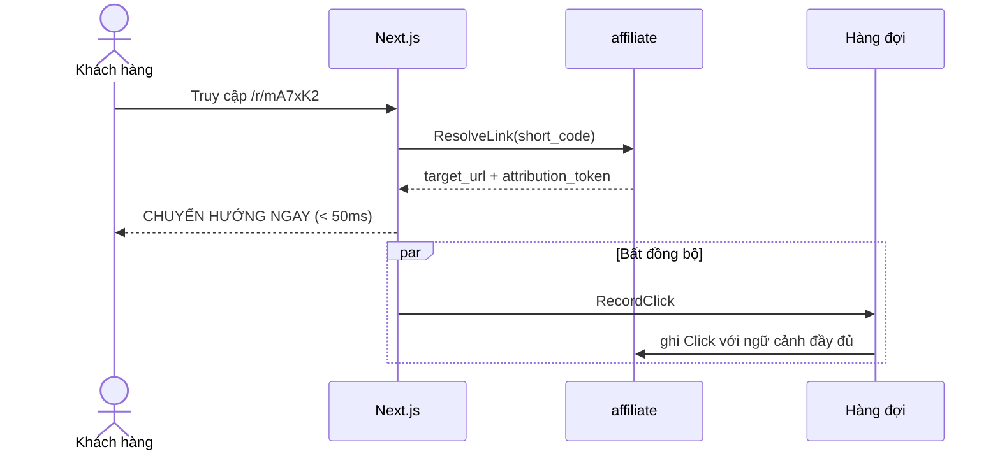
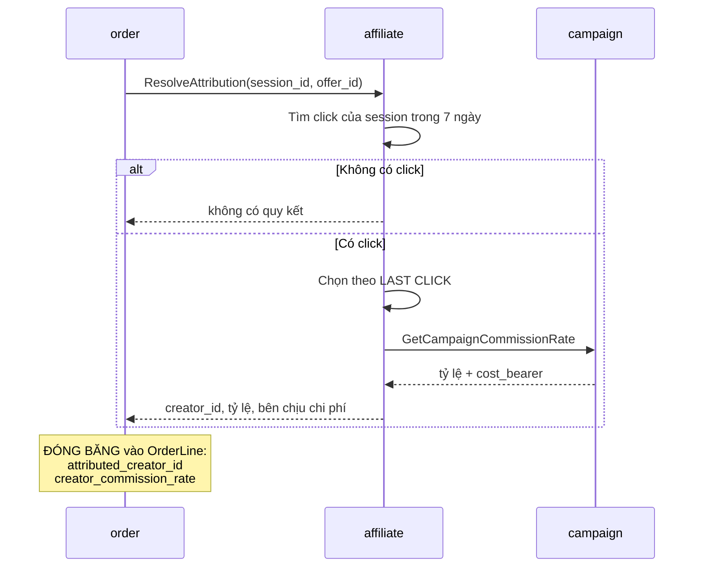
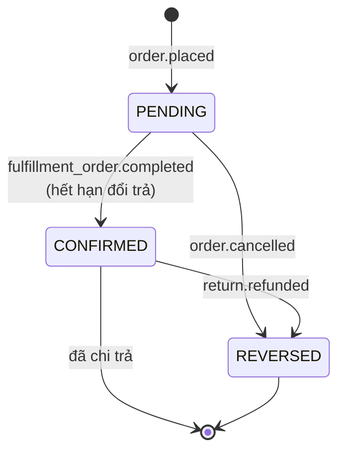
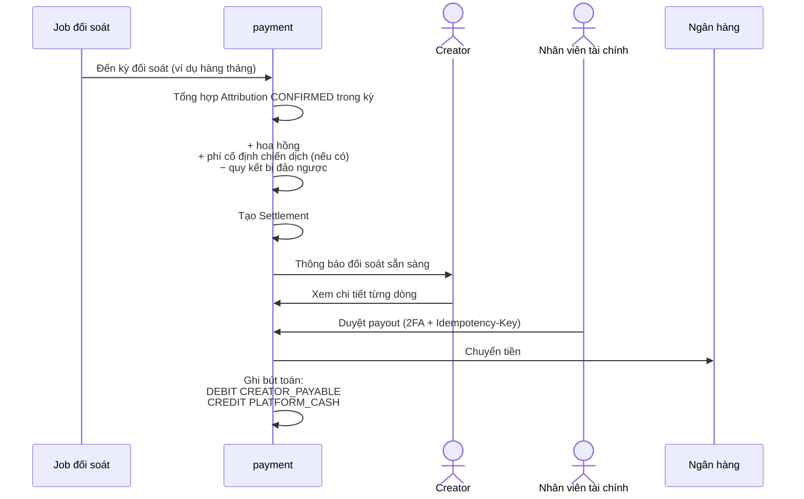
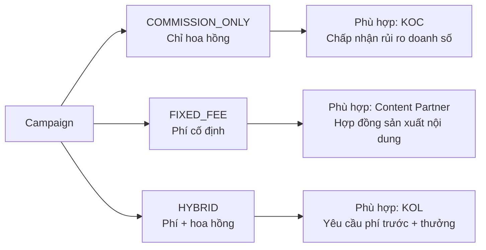

# Luồng: Creator affiliate

## 1. Tổng quan

```text
Đăng ký → Duyệt → Tạo link → Ghi click → Quy kết → Hoa hồng → Chi trả
```

---

## 2. Đăng ký và phê duyệt



---

## 3. Ghi nhận click — yêu cầu hiệu năng



**Nguyên tắc:** ghi click **không được làm chậm chuyển hướng**. Khách bấm link phải tới trang sản phẩm ngay. Việc ghi nhận diễn ra song song.

### Dữ liệu ghi nhận

```text
Click {
    affiliate_link_id, creator_id
    session_id, customer_id (nullable)
    ip_hash              ← ĐÃ ẨN DANH HÓA
    device_fingerprint
    referrer, user_agent_hash
    clicked_at
}
```

Ghi đủ ngữ cảnh để phát hiện gian lận **sau này**, nhưng việc phát hiện chạy bất đồng bộ.

**Về `ip_hash`:** lưu IP dạng gốc là dữ liệu cá nhân, cần cơ sở pháp lý. Băm là đủ cho mục đích phát hiện bất thường.

---

## 4. Quy kết khi đặt hàng



### Ai chịu chi phí hoa hồng creator

```text
Sản phẩm own brand              → nền tảng chịu
Chiến dịch do seller khởi xướng → seller chịu (trừ vào phần seller)
Chiến dịch do nền tảng khởi xướng → nền tảng chịu (khuyến khích seller tham gia)
Thỏa thuận chia sẻ              → chia theo tỷ lệ
```

Thông tin `cost_bearer` được **đóng băng vào `Attribution`** — không tra cứu động khi đối soát.

---

## 5. Vòng đời hoa hồng



**Điểm quan trọng:** hoa hồng chỉ chuyển `PENDING → CONFIRMED` sau khi **hết hạn đổi trả**, không phải khi giao hàng.

```text
Nếu chi trả ngay khi giao:
    → khách hoàn hàng
    → phải ĐÒI LẠI tiền từ creator
    → rất khó, đặc biệt với KOC nhỏ

Nếu chờ hết hạn đổi trả:
    → phần lớn hoàn hàng xảy ra trước khi chi
    → chỉ cần trừ vào số dư
```

---

## 6. Đối soát và chi trả creator



**Yêu cầu minh bạch:** creator phải xem được **từng dòng** — nội dung nào, đơn nào (mã ẩn danh), hoa hồng bao nhiêu. Đối soát không minh bạch là nguyên nhân creator rời nền tảng.

Nhưng: **không hiển thị danh tính khách hàng**. Chỉ mã tham chiếu ẩn danh.

---

## 7. Ba cấu trúc chi phí chiến dịch



**Sai lầm cần tránh:** thiết kế `Campaign` chỉ với một trường `commission_rate` — không mô hình hóa được KOL yêu cầu phí cố định, buộc phải xử lý ngoài hệ thống.

---

## 8. Ranh giới quyền riêng tư

```text
Creator ĐƯỢC thấy:
    ✓ Số click, số đơn, doanh thu quy kết (TỔNG HỢP)
    ✓ Hoa hồng của mình
    ✓ Hiệu suất theo nội dung, theo sản phẩm
    ✓ Tỷ lệ hoàn hàng theo nội dung (để cải thiện)

Creator KHÔNG thấy:
    ✗ Tên, email, số điện thoại khách hàng
    ✗ Địa chỉ giao hàng
    ✗ Mã đơn hàng thật
    ✗ Lịch sử mua hàng của cá nhân nào
```

**Lý do:** creator không phải bên xử lý dữ liệu cá nhân. Cung cấp dữ liệu khách cho creator vi phạm quy định bảo vệ dữ liệu ở nhiều thị trường.

---

## 9. Điểm cần giám sát

| Chỉ báo | Ngưỡng |
|---|---|
| Độ trễ chuyển hướng affiliate link | < 50ms |
| Click ghi nhận thất bại | < 0,1% |
| Tỷ lệ quy kết bị đảo ngược | Theo dõi theo creator |
| Tín hiệu gian lận | Cảnh báo khi vượt ngưỡng |
| Chi phí mỗi đơn qua creator | So với kênh khác |

---

## 10. Tài liệu liên quan

- [content-commerce.md](content-commerce.md)
- [../04-modules/affiliate.md](../04-modules/affiliate.md), [../04-modules/campaign.md](../04-modules/campaign.md)
- [../01-business/creator.md](../01-business/creator.md)
- [../06-api/creator-api.md](../06-api/creator-api.md)
