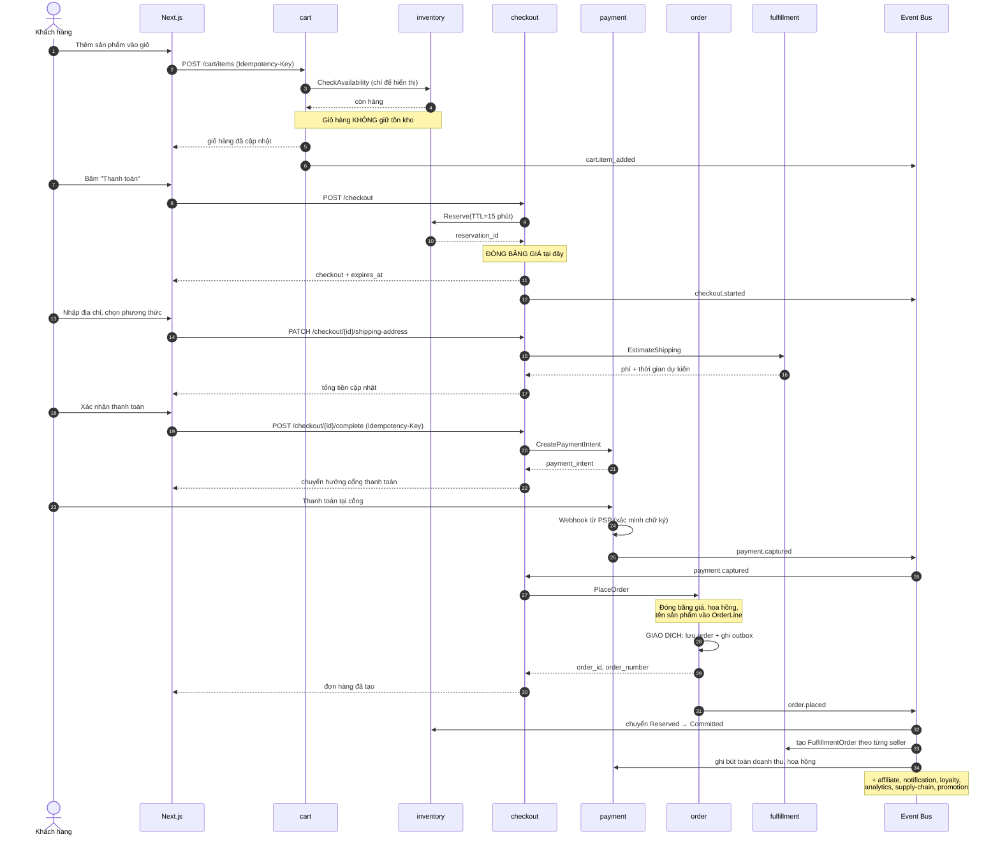
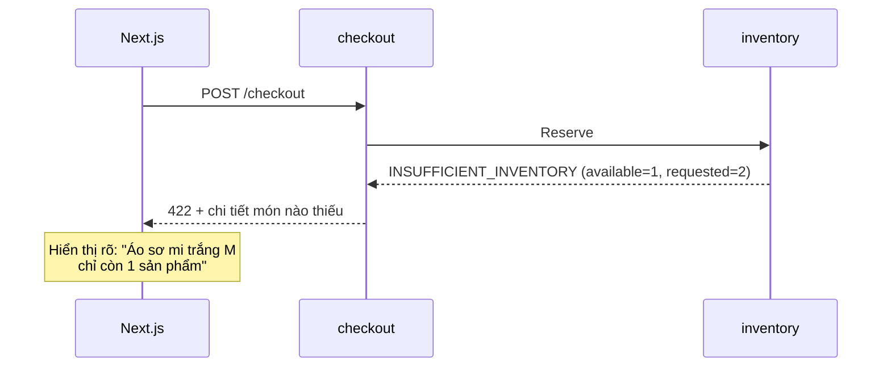
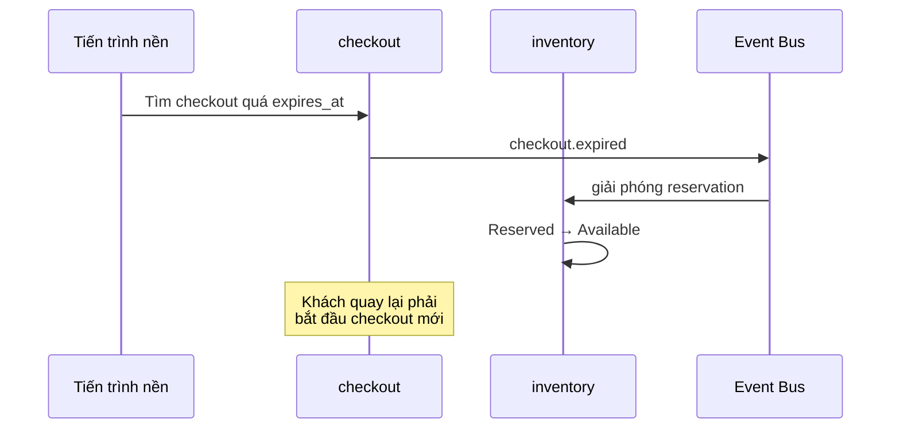
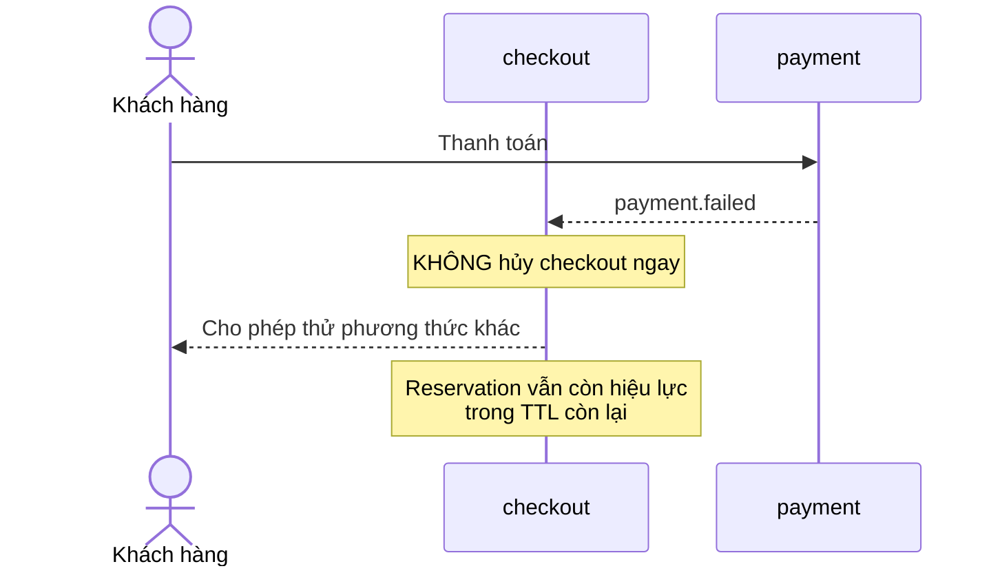

# Luồng: Khách hàng mua hàng

## 1. Tổng quan

```text
Khám phá → Xem sản phẩm → Thêm giỏ → Checkout → Thanh toán → Đơn hàng
```

Đây là luồng quan trọng nhất hệ thống. Mọi quyết định kiến trúc đều phải đảm bảo luồng này chạy đúng và nhanh.

---

## 2. Sequence diagram — luồng chính



---

## 3. Giải thích các quyết định trong luồng

### 3.1 Vì sao giỏ hàng không giữ tồn kho (bước 3)

```text
Nếu giỏ hàng giữ:
    - Khách thêm giỏ rồi bỏ quên 2 tuần → hàng khóa 2 tuần
    - Vài trăm giỏ bỏ quên = hết hàng ảo
    - Không bán được cho khách thật sự muốn mua

Đánh đổi chấp nhận:
    Khách có thể thấy "còn hàng" ở giỏ nhưng hết ở checkout.
    Hiển thị ở giỏ là THÔNG TIN THAM KHẢO, không phải cam kết.
```

### 3.2 Vì sao đóng băng giá ở checkout (bước 8)

```text
14:00 — Khách bắt đầu checkout, áo 299.000đ
14:05 — Seller đổi giá thành 350.000đ
14:10 — Khách hoàn tất thanh toán

Không đóng băng → khách thấy 299.000đ nhưng bị trừ 350.000đ
Đóng băng      → khách trả đúng 299.000đ như đã thấy
```

### 3.3 Vì sao ghi order và event trong cùng giao dịch (bước 20)

Transactional outbox — đảm bảo:

```text
✓ Giao dịch thành công → event CHẮC CHẮN được phát
✓ Giao dịch thất bại   → event KHÔNG BAO GIỜ được phát
```

Nếu tách, có thể tạo đơn thành công nhưng không phát event — đơn hàng "mồ côi", không ai xử lý.

### 3.4 Vì sao `order` không gọi `inventory` trực tiếp

`checkout` đã giữ hàng từ trước. Khi `order.placed` được phát, `inventory` tự chuyển `Reserved → Committed`.

Điều này giữ module `order` mỏng và không phải xử lý lỗi tồn kho ở thời điểm tạo đơn — thời điểm đã quá muộn để báo khách hết hàng.

---

## 4. Các nhánh thất bại

### 4.1 Hết hàng khi bắt đầu checkout



**Nguyên tắc:** báo lỗi phải nêu rõ **món nào** và **còn bao nhiêu**, không chỉ "hết hàng". Khách cần đủ thông tin để quyết định (giảm số lượng hay bỏ món đó).

### 4.2 Checkout hết hạn



**Yêu cầu vận hành:** tiến trình này phải **đáng tin cậy**. Nếu nó ngừng chạy, hàng bị khóa dần và cuối cùng không bán được gì. Cần giám sát: cảnh báo nếu có reservation quá hạn lâu chưa xử lý.

### 4.3 Thanh toán thất bại



**Quyết định thiết kế:** thất bại thanh toán **không hủy checkout**. Cho khách thử lại trong thời gian TTL còn lại. Hủy ngay là trải nghiệm tệ và làm mất đơn hàng không cần thiết.

---

## 5. Luồng khách vãng lai

```text
Khác biệt duy nhất:
    - Không có customer_id, dùng session_id
    - Bắt buộc nhập email + số điện thoại ở checkout
    - Order lưu guest_email, guest_phone
    - Tra cứu đơn bằng order_number + số điện thoại

Không khác biệt:
    - Vẫn giữ tồn kho, vẫn đóng băng giá
    - Vẫn tạo đơn hàng bình thường
```

Khách vãng lai được phép đặt hàng — quyết định giảm rào cản chuyển đổi, đặc biệt quan trọng với khách đến từ nội dung creator (trạng thái mua ngẫu hứng).

---

## 6. Điểm cần giám sát

| Bước | Chỉ báo | Ngưỡng |
|---|---|---|
| Thêm giỏ | Tỷ lệ lỗi | < 0,1% |
| Bắt đầu checkout | Tỷ lệ thất bại do hết hàng | < 5% |
| Giữ tồn kho | Thời gian xử lý (p99) | < 100ms |
| Thanh toán | Tỷ lệ thất bại | < 3% |
| Tạo đơn | Thời gian xử lý (p99) | < 500ms |
| Toàn luồng | Tỷ lệ hoàn tất checkout | Theo dõi xu hướng |

---

## 7. Tài liệu liên quan

- [marketplace-order.md](marketplace-order.md) — chi tiết đơn nhiều nhà bán
- [../04-modules/checkout.md](../04-modules/checkout.md), [../04-modules/order.md](../04-modules/order.md)
- [../06-api/customer-api.md](../06-api/customer-api.md)
