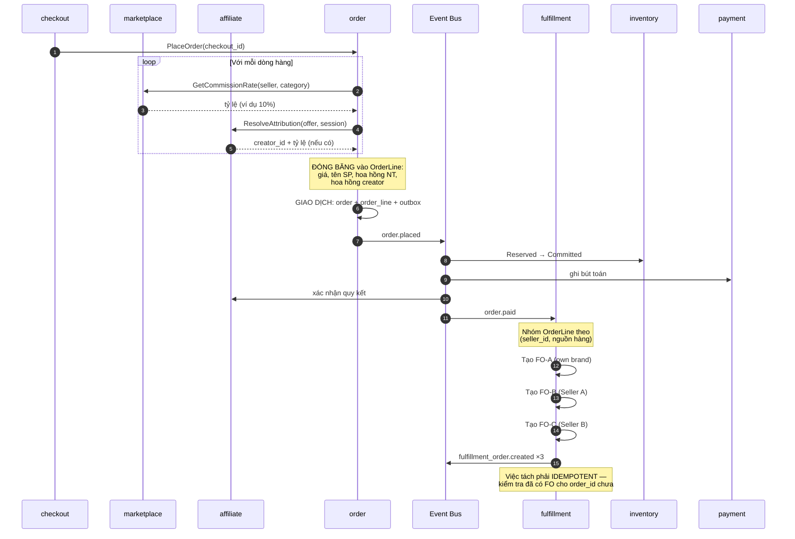
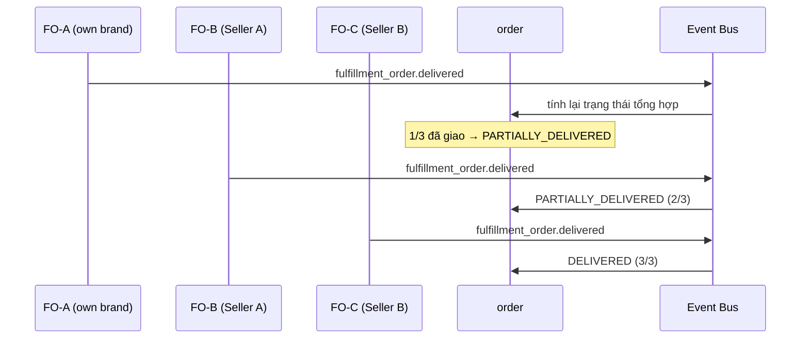
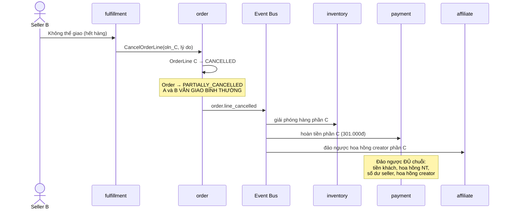
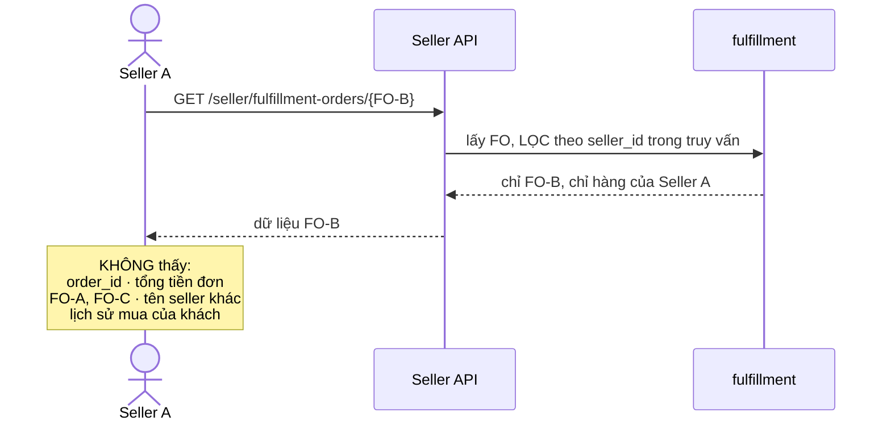
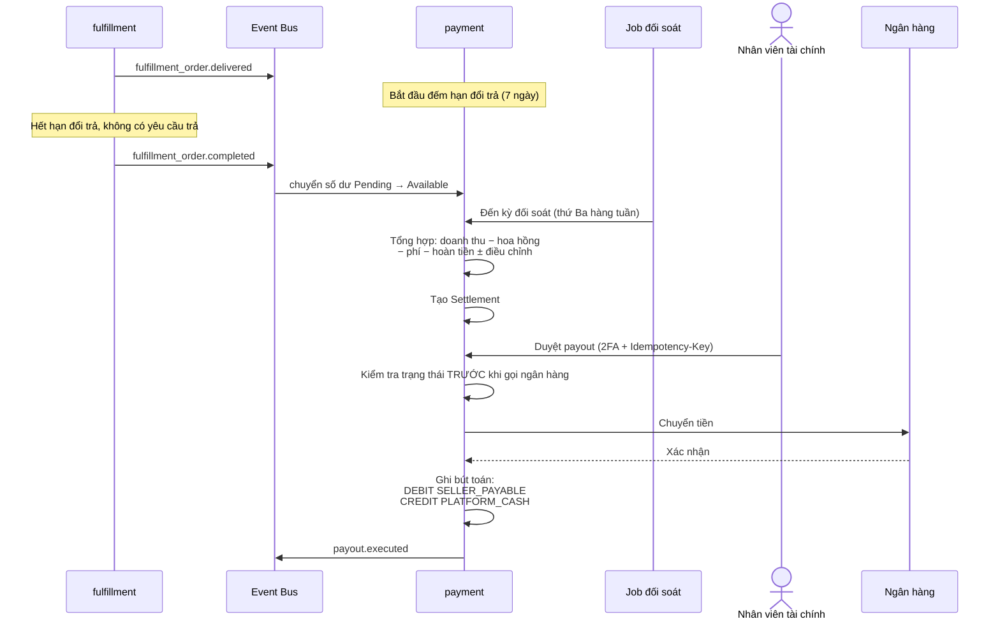

# Luồng: Đơn hàng nhiều nhà bán

## 1. Tình huống

```text
Giỏ hàng của khách:
├── Áo sơ mi own brand      (kho nền tảng, Hà Nội)     299.000đ
├── Giày từ Seller A         (kho seller A, TP.HCM)     650.000đ
└── Túi từ Seller B          (kho seller B, Đà Nẵng)    301.000đ
                                                    ─────────────
                                          Tổng:      1.250.000đ
```

Ba món này **không thể** đóng chung một gói. Chúng ở ba nơi, do ba bên xử lý.

---

## 2. Mô hình dữ liệu

```text
Khách nhìn thấy:
    Order #FC-2026-08-001234 — 1.250.000đ

Hệ thống thực thi:
    Order #FC-2026-08-001234
    ├── FulfillmentOrder ...-A  (own brand)  → giao 11/08
    ├── FulfillmentOrder ...-B  (Seller A)   → giao 13/08
    └── FulfillmentOrder ...-C  (Seller B)   → giao 14/08
```

---

## 3. Sequence diagram — tạo đơn và tách



---

## 4. Bút toán tài chính

Đơn 1.250.000đ với ba nguồn hàng:

```text
LedgerEntry: ORDER_REVENUE, ref=Order#FC-2026-08-001234

Phần own brand (299.000đ):
  DEBIT   PLATFORM_CASH                    299.000
  CREDIT  PLATFORM_REVENUE                 299.000

  (bút toán riêng cho COGS)
  DEBIT   COGS                             120.000
  CREDIT  INVENTORY_ASSET                  120.000

Phần Seller A (650.000đ, hoa hồng 8%):
  DEBIT   PLATFORM_CASH                    650.000
  CREDIT  SELLER_PAYABLE (A)               598.000
  CREDIT  PLATFORM_REVENUE                  52.000

Phần Seller B (301.000đ, hoa hồng 12%, creator 5%):
  DEBIT   PLATFORM_CASH                    301.000
  CREDIT  SELLER_PAYABLE (B)               249.880
  CREDIT  PLATFORM_REVENUE                  36.120
  CREDIT  CREATOR_PAYABLE                   15.050
```

**Quan sát quan trọng:**

```text
GMV       = 1.250.000đ
Doanh thu nền tảng = 299.000 (own brand toàn phần)
                   + 52.000  (hoa hồng A)
                   + 36.120  (hoa hồng B)
                   = 387.120đ

GMV ≠ Doanh thu. Phân biệt này nằm ở TẦNG GHI SỔ,
không phải xử lý sau bằng báo cáo.
```

---

## 5. Xử lý từng phần — điều chỉ khả thi khi tách Order/FO

### 5.1 Giao hàng từng phần



Khách nhận món A trước, không phải chờ cả ba.

### 5.2 Hủy từng phần — Seller B hết hàng



**Điểm mấu chốt:** đơn hàng **không** bị hủy toàn bộ. Nếu mô hình chỉ có một `Order` với một trạng thái, không làm được điều này — phải hủy cả đơn, khách mất luôn hai món còn lại.

### 5.3 Vấn đề phí vận chuyển khi hủy một phần

```text
Khách mua 1.250.000đ, miễn phí ship (ngưỡng 500.000đ)
Hủy món 301.000đ → còn 949.000đ, vẫn đạt ngưỡng → không vấn đề

Nhưng nếu ngưỡng là 1.000.000đ:
    → sau khi hủy còn 949.000đ, không còn đạt ngưỡng

Câu hỏi: có thu lại phí ship không?
```

**Quyết định: KHÔNG thu lại.**

Lý do: chi phí xử lý tranh chấp và tổn hại trải nghiệm lớn hơn số tiền thu về. Khách bị phạt vì lỗi của seller là trải nghiệm rất tệ.

Quyết định này phải được ghi vào quy tắc nghiệp vụ, không để mỗi trường hợp xử lý một kiểu.

---

## 6. Ranh giới dữ liệu giữa các seller



**Đây là lý do kỹ thuật thứ hai cho việc tách Order/FulfillmentOrder** (bên cạnh lý do tranh chấp ghi).

Nếu seller truy cập `Order`, phải lọc dữ liệu ở tầng hiển thị — chỉ cần quên một lần là rò rỉ dữ liệu đối thủ. Với `FulfillmentOrder`, ranh giới nằm sẵn trong cấu trúc dữ liệu.

---

## 7. Đối soát và chi trả



### Vì sao chỉ chi trả sau khi hết hạn đổi trả

```text
Nếu trả tiền ngay khi giao hàng:
    → khách hoàn hàng
    → nền tảng phải ĐÒI LẠI tiền từ seller
    → rất khó thu hồi, đặc biệt với seller nhỏ

Nếu chờ hết hạn đổi trả:
    → phần lớn trường hợp hoàn hàng xảy ra TRƯỚC khi chi tiền
    → chỉ cần trừ vào số dư, không phải đòi
```

### Xử lý số dư âm

```text
Seller bị hoàn 2 triệu, chỉ bán được 1 triệu trong kỳ
    → Số dư kỳ này = −1.000.000đ

Xử lý:
    1. KHÔNG chuyển tiền âm
    2. Chuyển khoản âm sang kỳ sau
    3. Nếu âm kéo dài → yêu cầu nộp bù
    4. Nếu seller ngừng hoạt động → khoản phải thu khó đòi

Phòng ngừa: giữ reserve với seller mới hoặc tỷ lệ hoàn cao
```

---

## 8. Điểm cần giám sát

| Chỉ báo | Ngưỡng |
|---|---|
| Đơn không tách được thành FO | 0 |
| Σ FulfillmentLine ≠ Σ OrderLine | 0 |
| Bút toán không cân bằng | 0 |
| Payout thất bại | Cảnh báo ngay |
| Seller có số dư âm | Theo dõi danh sách |
| Tỷ lệ hủy do seller hết hàng | < 3% |

Ba chỉ báo đầu phải luôn bằng 0.

---

## 9. Tài liệu liên quan

- [../adr/0007-marketplace-order-model.md](../adr/0007-marketplace-order-model.md)
- [../adr/0008-financial-ledger.md](../adr/0008-financial-ledger.md)
- [../04-modules/fulfillment.md](../04-modules/fulfillment.md), [../04-modules/payment.md](../04-modules/payment.md)
- [../01-business/monetization.md](../01-business/monetization.md)
