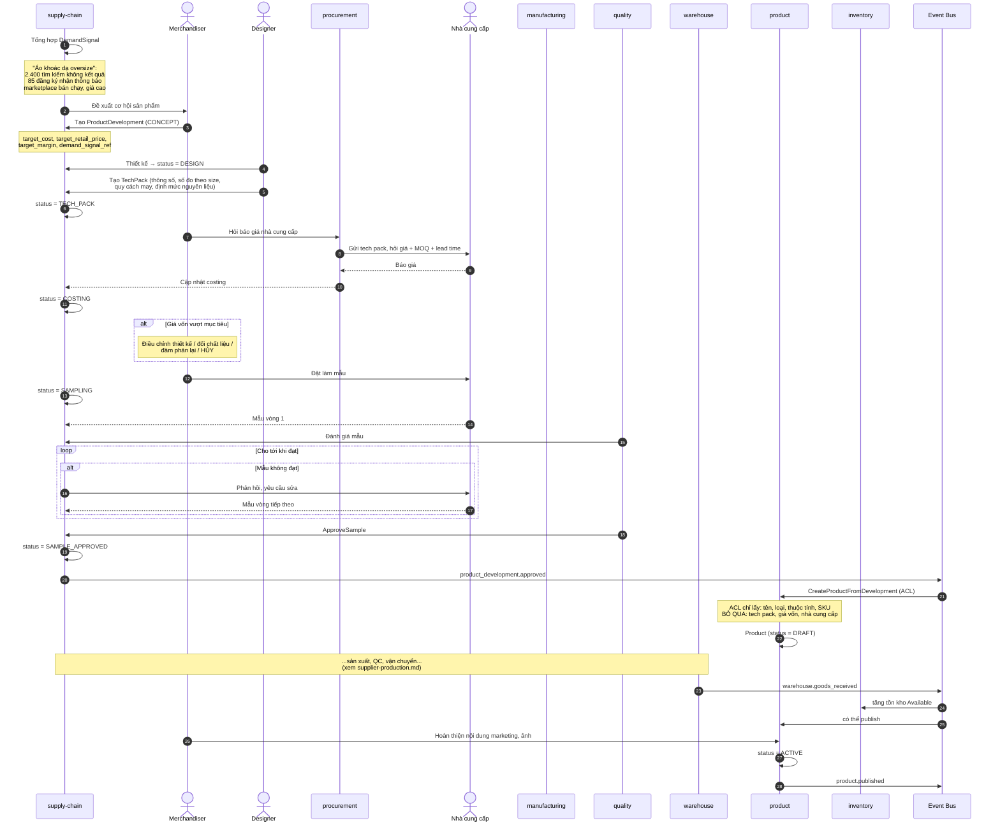
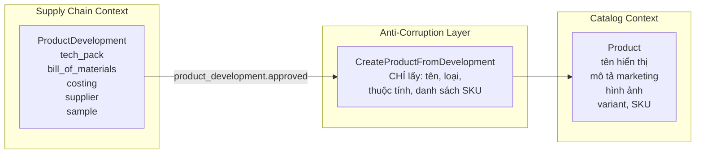
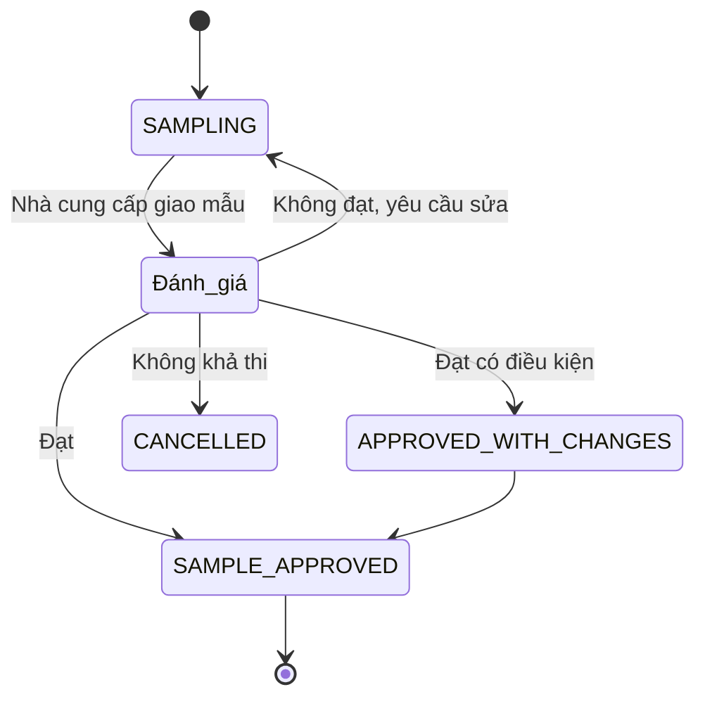
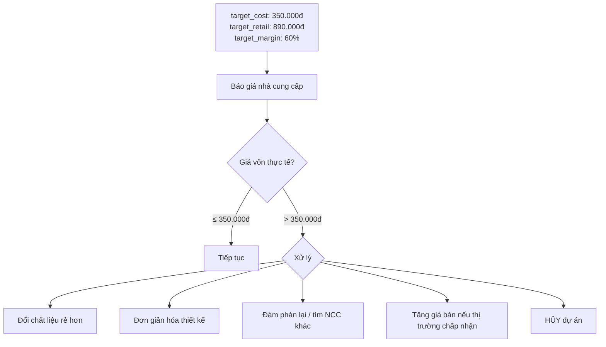

# Luồng: Tạo sản phẩm own brand

## 1. Tổng quan — vòng đời dài

```text
Concept → Design → Tech Pack → Costing → Sampling → Duyệt mẫu
→ Planning → Production → QC → Nhập kho → Lên sàn → Bán
```

Thời gian điển hình: **3–6 tháng** với sản phẩm mới.

Đây là khác biệt lớn nhất so với marketplace — sản phẩm own brand không xuất hiện từ hư không.

---

## 2. Sequence diagram — từ ý tưởng tới lên sàn



---

## 3. Điểm khởi đầu: tín hiệu nhu cầu

Đây là điều phân biệt nền tảng này với thương hiệu thời trang truyền thống.

```text
Thương hiệu truyền thống:
    Nhà thiết kế cảm nhận xu hướng → thiết kế → sản xuất → hy vọng bán được

Nền tảng có dữ liệu:
    Đo nhu cầu THẬT trên chính nền tảng → thiết kế đúng thứ đang thiếu
```

### Ví dụ cụ thể

```text
Dữ liệu 30 ngày:
    - 2.400 lượt tìm "áo khoác dạ oversize" không ra kết quả phù hợp
    - 85 lượt đăng ký nhận thông báo có hàng
    - Sản phẩm tương tự của seller bán 340 chiếc, giá 890.000đ
    - Tỷ lệ hoàn của sản phẩm đó: 8% (thấp — form dáng ổn)

Kết luận:
    ✓ Nhu cầu đã được kiểm chứng
    ✓ Giá thị trường chấp nhận được ~890.000đ
    ✓ Own brand có thể làm giá vốn ~350.000đ → biên 60%
    → Quyết định sản xuất
```

Đây là lý do dữ liệu hành vi phải **quay ngược được** vào domain supply chain. Nếu nó nằm trong công cụ analytics bên thứ ba, bánh đà bị đứt.

---

## 4. Anti-Corruption Layer — ranh giới quan trọng



**Vì sao cần:** nếu Catalog biết về tech pack, giá vốn, nhà cung cấp:

```text
- Mô hình catalog bị ô nhiễm bởi khái niệm sản xuất
- Bảng product có 40 cột luôn null với sản phẩm marketplace
- Catalog phụ thuộc Supply Chain → không tách được
- Nhân viên vận hành catalog thấy giá vốn (thông tin nhạy cảm)
```

Xem [../02-domain/bounded-contexts.md](../02-domain/bounded-contexts.md) mục 5.

---

## 5. Vòng lặp làm mẫu — điểm nghẽn thường gặp



**Chỉ số cần theo dõi:** `sample_approval_cycles` — số vòng làm mẫu trung bình.

```text
Nhà cung cấp cần 5 vòng mẫu:
    → mỗi vòng mất 2–3 tuần
    → 10–15 tuần chỉ để duyệt mẫu
    → LỠ MÙA BÁN

Đây là chỉ số đánh giá nhà cung cấp quan trọng,
không kém gì giá và chất lượng.
```

---

## 6. Phân bổ size — quyết định tốn tiền nhất

```text
Sản xuất 500 áo KHÔNG phải 500 chiếc giống nhau:

    S:   15%  =  75
    M:   30%  = 150
    L:   30%  = 150
    XL:  20%  = 100
    XXL:  5%  =  25
```

### Hậu quả phân bổ sai

```text
Hết size M trong 2 tuần    → mất doanh số ở size bán chạy nhất
Tồn XXL đến cuối mùa       → phải xả giá, mất 50-70% giá trị

Thiệt hại KÉP.
```

### Đầu vào cho quyết định

```text
- Dữ liệu bán hàng lịch sử theo size (sản phẩm tương tự)
- Tỷ lệ hoàn theo size (nếu size M hay bị trả vì chật → form lệch)
- Phân bố size của khách hàng nền tảng
- Đặc thù kiểu dáng (oversize → nhiều size nhỏ hơn)
```

**Hệ quả kiến trúc:** kế hoạch sản xuất phải ở mức **SKU** (bao gồm size), không phải mức Product.

---

## 7. Kiểm soát giá vốn



**Nguyên tắc:** kiểm soát giá vốn ở bước **costing**, trước khi làm mẫu. Phát hiện giá vốn quá cao sau khi đã làm 3 vòng mẫu là lãng phí thời gian và tiền.

---

## 8. Điểm cần giám sát

| Chỉ báo | Mục tiêu |
|---|---|
| Concept-to-shelf time | < 120 ngày |
| Sample approval cycles | < 3 vòng |
| Cost variance (thực tế vs mục tiêu) | < 10% |
| Tỷ lệ dự án bị hủy sau costing | Theo dõi |
| Tỷ lệ sản phẩm ra mắt đúng lịch bộ sưu tập | > 90% |
| Sell-through sau 12 tuần | > 80% |

---

## 9. Tài liệu liên quan

- [supplier-production.md](supplier-production.md) — bước sản xuất
- [replenishment.md](replenishment.md) — tái sản xuất
- [../01-business/own-brand.md](../01-business/own-brand.md)
- [../04-modules/supply-chain.md](../04-modules/supply-chain.md)
