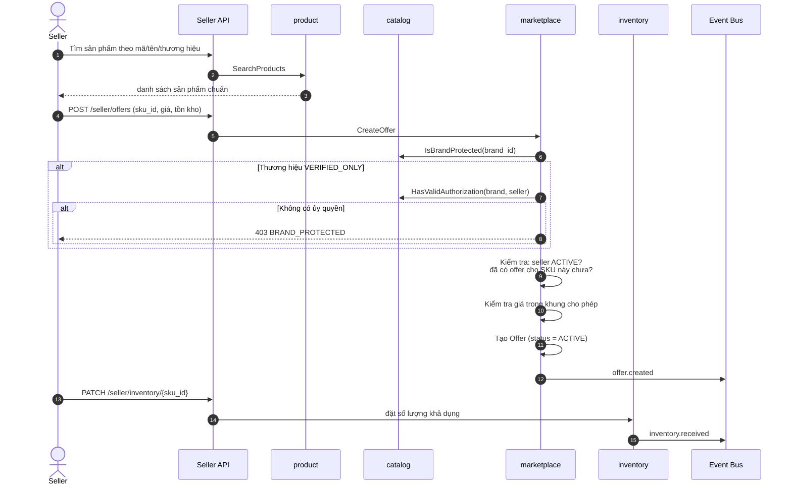
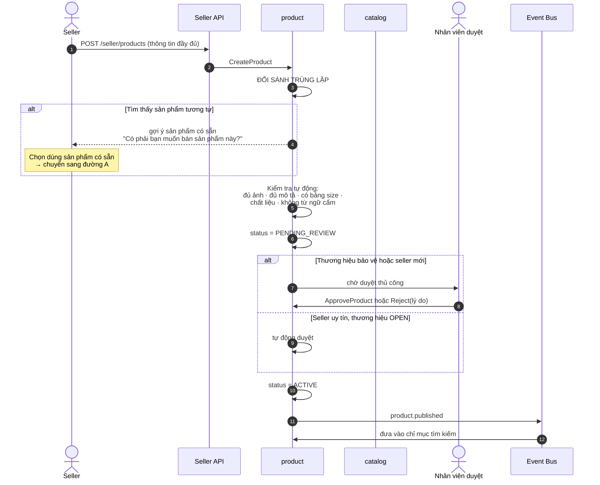
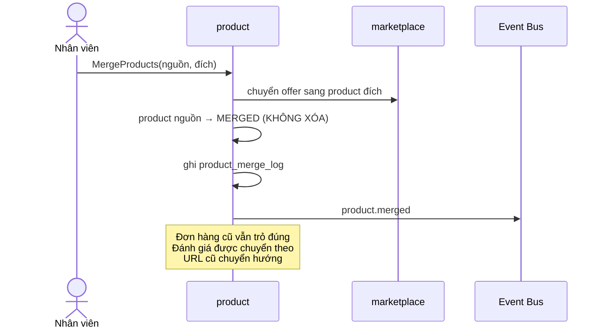
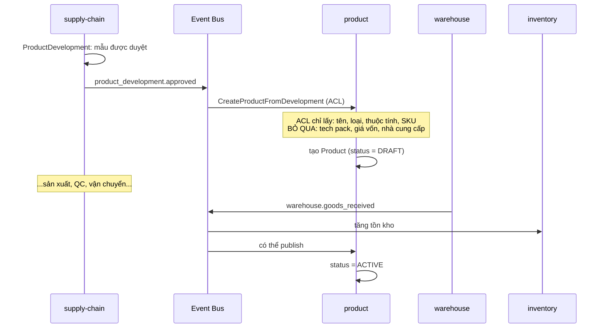

# Luồng: Đăng bán sản phẩm

## 1. Hai đường đi khác nhau

```text
A. Seller bán sản phẩm ĐÃ CÓ trong danh mục
   → chỉ tạo Offer, không tạo Product

B. Seller tạo sản phẩm MỚI
   → tạo Product + Variant + SKU, rồi tạo Offer
```

Đường A được ưu tiên — nó chống trùng lặp danh mục.

---

## 2. Đường A: Tạo offer trên sản phẩm có sẵn



---

## 3. Ba lớp kiểm soát khi tạo offer

### 3.1 Bảo vệ thương hiệu — chống hàng giả

```text
brand.protection_level:

OPEN           → seller nào cũng tạo offer được
VERIFIED_ONLY  → phải có brand_authorization còn hiệu lực
RESTRICTED     → chỉ seller được chỉ định
```

Đây là **quy tắc domain bắt buộc**, kiểm tra trong code, không phải quy trình thủ công bên ngoài.

Hàng giả là rủi ro sống còn của marketplace thời trang: kiện tụng, mất quyền phân phối thương hiệu chính hãng, mất niềm tin khách hàng.

### 3.2 Khung giá — chống hai rủi ro

```text
Giá dưới mức tối thiểu:
    → có thể là bán phá giá
    → hoặc lỗi nhập liệu (thiếu số 0: nhập 50.000 thay vì 500.000)

Giá trên mức tối đa:
    → thổi giá, lừa khách
```

Lỗi nhập liệu phổ biến hơn nhiều so với gian lận — khung giá bảo vệ chính seller.

### 3.3 Một seller một offer active cho một SKU

Thực thi bằng chỉ mục duy nhất có điều kiện ở tầng database:

```sql
CREATE UNIQUE INDEX idx_offer_unique_active
    ON offer (sku_id, seller_id) WHERE status = 'ACTIVE';
```

---

## 4. Đường B: Tạo sản phẩm mới



---

## 5. Yêu cầu bắt buộc cho sản phẩm thời trang

```text
Bắt buộc — CheckReadyForReview cưỡng chế, gửi duyệt sẽ bị từ chối nếu thiếu:
    ✓ Ít nhất MỘT ảnh
    ✓ Mô tả
    ✓ Chất liệu (material_composition)
    ✓ Bảng size (size_chart_id) — chỉ với loại sản phẩm CẦN bảng size;
      túi và phụ kiện thì không
    ✓ Ít nhất một variant với ít nhất một SKU

Khuyến khích mạnh — KHÔNG chặn gửi duyệt:
    - Ba ảnh trở lên: mặt trước, mặt sau, chi tiết
    - Hướng dẫn bảo quản
    - Xuất xứ
    - Ảnh trên người mẫu có nêu số đo
    - Ảnh chi tiết chất liệu
```

**Bản trước của mục này đòi ≥3 ảnh, hướng dẫn bảo quản và xuất xứ ở nhóm
BẮT BUỘC. Mã chưa bao giờ cưỡng chế ba thứ đó** — `CheckReadyForReview`
kiểm một ảnh và không nhắc tới hai trường kia. Nới tài liệu theo mã
(23/09/2026), không siết mã theo tài liệu.

Lý do: con số 3 chưa ai đo xem có đúng không, và một tài liệu nói "bắt
buộc" về thứ không ai cưỡng chế sẽ dẫn người đọc sau viết mã theo nó rồi
phát hiện hệ thống nói khác. Khi có số liệu hoàn hàng thật, siết lại là một
quyết định có bằng chứng — xem mục "Điểm cần giám sát".

**Vì sao những thứ này bắt buộc:** chúng ảnh hưởng **trực tiếp** tới tỷ lệ hoàn hàng — vấn đề kinh tế lớn nhất của thương mại thời trang.

```text
Thiếu bảng size    → khách chọn sai size → hoàn hàng
Thiếu chất liệu    → khách mua nhầm → hoàn hàng
Ảnh không đủ       → khác kỳ vọng → hoàn hàng
```

---

## 6. Chống trùng lặp danh mục

```text
Vấn đề: nhiều seller đăng cùng một hàng nhưng tạo product riêng
    → khách tìm "áo thun Uniqlo U" thấy 40 kết quả giống hệt
    → không so sánh được giá
    → trải nghiệm tệ, SEO tệ

Ba cơ chế:
    1. Đối sánh khi đăng bán (mã sản phẩm, tên, thương hiệu)
    2. Danh mục chuẩn hóa — nền tảng tạo sẵn product cho thương hiệu lớn
    3. Quy trình gộp — admin gộp product trùng
```

### Quy trình gộp



**Không xóa product bị gộp** — đơn hàng cũ tham chiếu tới nó, và URL cũ cần chuyển hướng để giữ SEO.

---

## 7. Sản phẩm own brand — đường đi thứ ba

Sản phẩm own brand **không** đi qua hai đường trên. Nó đến từ Supply Chain qua Anti-Corruption Layer:



**Vì sao cần ACL:** Catalog **không được biết** về tech pack, giá vốn, nhà cung cấp. Nếu những khái niệm này rò rỉ sang, mô hình catalog bị ô nhiễm bởi khái niệm sản xuất.

Xem [../02-domain/bounded-contexts.md](../02-domain/bounded-contexts.md) mục 5.

---

## 8. Điểm cần giám sát

| Chỉ báo | Ngưỡng |
|---|---|
| Thời gian duyệt sản phẩm | < 24 giờ |
| Tỷ lệ sản phẩm bị từ chối | Theo dõi theo seller |
| Tỷ lệ trùng lặp phát hiện được | Theo dõi xu hướng |
| Offer bị chặn do thương hiệu bảo vệ | Theo dõi (dấu hiệu hàng giả) |
| Sản phẩm thiếu bảng size | 0 với loại CẦN bảng size (bắt buộc) |
| Tỷ lệ hoàn hàng theo SỐ ẢNH của sản phẩm | chưa đo — đây là số liệu quyết định có siết ≥3 ảnh hay không |

---

## 9. Tài liệu liên quan

- [../04-modules/product.md](../04-modules/product.md), [../04-modules/marketplace.md](../04-modules/marketplace.md)
- [../01-business/marketplace.md](../01-business/marketplace.md) mục 4
- [own-brand-product.md](own-brand-product.md)
