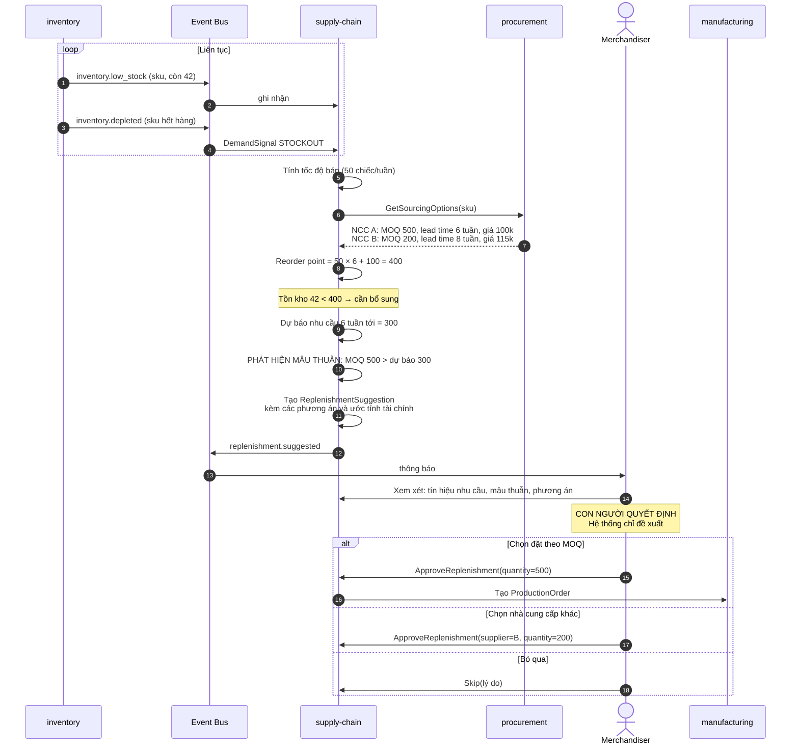
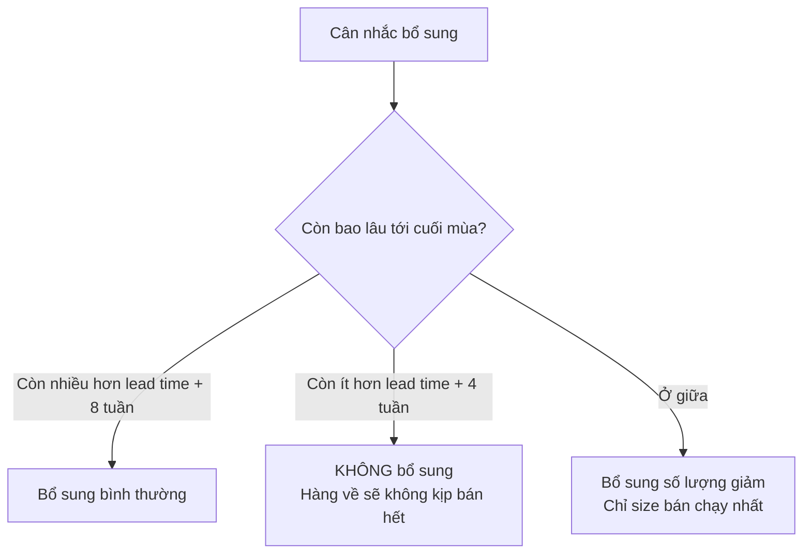

# Luồng: Bổ sung hàng (Replenishment)

## 1. Khác biệt với sản phẩm mới

```text
Sản phẩm mới (own-brand-product.md):
    Concept → Design → Tech Pack → Mẫu → Duyệt → Sản xuất
    3–6 tháng

Bổ sung hàng (tài liệu này):
    Tech pack đã có, mẫu đã duyệt, nhà cung cấp đã biết
    → Chỉ cần quyết định: bao nhiêu, khi nào
    4–8 tuần
```

---

## 2. Sequence diagram



---

## 3. Công thức điểm đặt hàng lại

```text
Reorder point = (Tốc độ bán × Lead time) + Safety stock

Ví dụ:
    Tốc độ bán:    50 chiếc/tuần
    Lead time:     6 tuần
    Safety stock:  100 chiếc
    ────────────────────────────────
    Reorder point = 50 × 6 + 100 = 400
```

### Safety stock — đệm cho biến động

```text
Safety stock bù cho:
    - Nhu cầu tăng đột biến (nội dung viral, thời tiết đổi)
    - Nhà cung cấp giao trễ
    - Sai số dự báo

Với thời trang, biến động cao hơn ngành khác
→ safety stock cần lớn hơn, nhưng cân với rủi ro tồn cuối mùa
```

---

## 4. Tín hiệu nhu cầu — bao gồm nhu cầu BỊ BỎ LỠ

Đây là điểm quan trọng nhất và thường bị bỏ qua.

```text
Nếu chỉ nhìn doanh số:
    "Bán 200 chiếc" → kết luận: nhu cầu 200

Thực tế đầy đủ:
    - Bán 200 chiếc
    - Hết hàng từ tuần thứ 3
    - 1.500 lượt tìm kiếm sau khi hết hàng
    - 400 lượt đăng ký nhận thông báo
    - 190 lượt thêm wishlist
    → nhu cầu thật gần 800
```

**Hệ quả:** lập kế hoạch chỉ dựa vào doanh số lịch sử sẽ **liên tục sản xuất thiếu** hàng bán chạy. Đây là sai lầm kinh điển của ngành.

### Tín hiệu cần thu thập

```text
Từ inventory:   inventory.depleted (STOCKOUT)
Từ product:     tìm kiếm không ra kết quả (SEARCH_NO_RESULT)
Từ customer:    đăng ký nhận thông báo (NOTIFY_REQUEST)
                thêm wishlist (WISHLIST)
Từ cart:        thêm giỏ (ADD_TO_CART)
Từ content:     lượt xem, click (VIEW, CLICK)
Từ order:       đơn hàng thực tế (ORDER)
Từ return:      hoàn hàng và lý do (RETURN)
```

Đây là lý do **phải ghi tín hiệu nhu cầu từ MVP**, dù chuỗi cung ứng chỉ triển khai ở Phase 3. Dữ liệu lịch sử không tạo ngược được.

---

## 5. Hiển thị mâu thuẫn — phần mềm hỗ trợ ra quyết định

```json
{
  "sku_code": "SM-LIN-OXF-WHT-M",
  "current_stock": 42,
  "reorder_point": 400,
  "sales_velocity_per_week": 50,
  "demand_signals": {
    "stockout_events_30d": 3,
    "search_no_result_30d": 240,
    "notify_requests": 85,
    "wishlist_adds_30d": 190
  },
  "constraints": {
    "supplier_moq": 500,
    "forecast_demand": 300,
    "conflict": true,
    "conflict_note": "MOQ 500 vượt dự báo 300. Rủi ro tồn 200 đơn vị (~20 triệu đồng)."
  },
  "options": [
    { "action": "ORDER_MOQ", "quantity": 500,
      "estimated_excess_risk": { "amount": 20000000, "currency": "VND" } },
    { "action": "SKIP",
      "estimated_lost_sales": { "amount": 89700000, "currency": "VND" } },
    { "action": "ALTERNATE_SUPPLIER", "supplier_id": "sup_B",
      "moq": 200, "unit_cost_delta": 15000 }
  ]
}
```

**Nguyên tắc thiết kế:**

```text
Hệ thống KHÔNG tự đặt hàng.
Hệ thống hiển thị:
    ✓ Tín hiệu nhu cầu đầy đủ (bao gồm nhu cầu bị bỏ lỡ)
    ✓ Mâu thuẫn MOQ vs dự báo
    ✓ Ước tính tài chính của TỪNG phương án

Con người quyết định.
```

**Vì sao không tự động đặt hàng:** một lỗi tính toán có thể dẫn tới đơn sản xuất sai hàng trăm triệu đồng. Rủi ro quá lớn so với lợi ích tiết kiệm vài phút thao tác.

---

## 6. Đặc thù thời trang: bổ sung theo size

```text
Tồn kho hiện tại:
    S:  85    (bán chậm)
    M:   8    ← SẮP HẾT
    L:  12    ← SẮP HẾT
    XL: 45
    XXL: 38   (bán rất chậm)

Bổ sung KHÔNG phải chia đều.
Bổ sung theo tốc độ bán thực tế của TỪNG SIZE:
    S:   0
    M: 200
    L: 200
    XL:  50
    XXL:  0
```

**Vấn đề gặp phải:** nhà cung cấp thường có MOQ **theo mẫu**, không theo size. Nếu MOQ là 500 nhưng chỉ cần 450 ở ba size, phải quyết định phân bổ 50 còn lại.

---

## 7. Yếu tố mùa vụ — quyết định ngừng bổ sung



**Ví dụ:**

```text
Áo khoác mùa đông, lead time 8 tuần
Còn 6 tuần nữa hết mùa

→ Hàng về khi mùa đã kết thúc
→ Phải giữ tới mùa sau (chi phí lưu kho, rủi ro lỗi mốt)
→ Hoặc xả giá ngay, mất 50-70% giá trị

QUYẾT ĐỊNH: không bổ sung
```

Đây là ràng buộc đặc thù thời trang mà ecommerce tổng quát không có.

---

## 8. Phân biệt hàng theo mùa và hàng cơ bản

```text
Hàng cơ bản (basic):
    Áo thun trắng, quần jeans đen
    → bán quanh năm, bổ sung đều đặn
    → có thể tự động hóa nhiều hơn

Hàng theo mùa (seasonal):
    Áo khoác dạ, váy hoa mùa hè
    → vòng đời ngắn, quyết định bổ sung phức tạp
    → cần cân nhắc thời điểm cuối mùa
```

**Hệ quả:** chiến lược bổ sung phải khác nhau theo loại. Cùng một công thức reorder point không phù hợp cho cả hai.

---

## 9. Điểm cần giám sát

| Chỉ báo | Mục tiêu |
|---|---|
| Stockout rate ở SKU bán chạy | < 5% |
| Forecast accuracy | > 70% |
| Đề xuất bổ sung bị bỏ qua | Theo dõi lý do |
| Thời gian từ đề xuất tới đặt hàng | < 5 ngày |
| Excess inventory cuối mùa | < 15% |
| Tỷ lệ đề xuất có mâu thuẫn MOQ | Theo dõi → đàm phán lại với NCC |

---

## 10. Tài liệu liên quan

- [supplier-production.md](supplier-production.md) — thực hiện đơn sản xuất
- [../04-modules/supply-chain.md](../04-modules/supply-chain.md)
- [../01-business/supply-chain.md](../01-business/supply-chain.md) mục 6
- [../06-api/admin-api.md](../06-api/admin-api.md) mục 5
