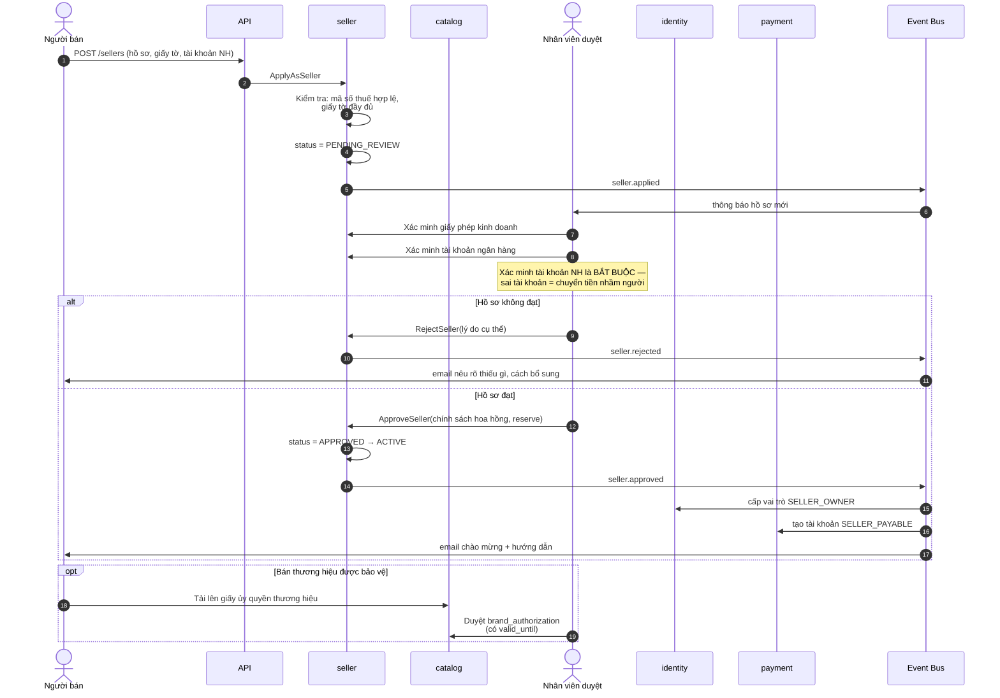
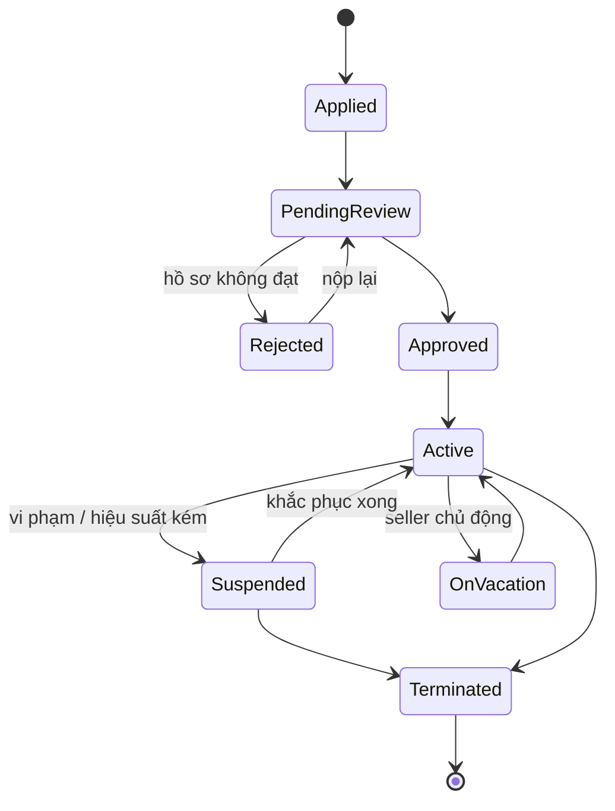
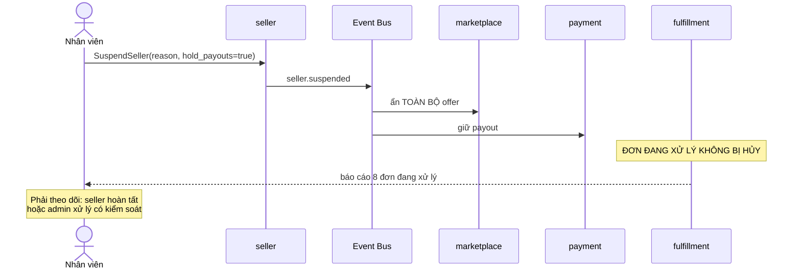

# Luồng: Đăng ký và phê duyệt nhà bán

## 1. Sequence diagram



---

## 2. Các bước xác minh bắt buộc

| Bước | Vì sao bắt buộc |
|---|---|
| Giấy phép kinh doanh | Trách nhiệm pháp lý, chống seller ảo |
| Mã số thuế | Nghĩa vụ thuế, hóa đơn |
| **Tài khoản ngân hàng** | **Sai tài khoản = chuyển tiền nhầm người, rất khó thu hồi** |
| Thông tin liên hệ | Xử lý sự cố, khiếu nại |
| Giấy ủy quyền thương hiệu | Chống hàng giả |

**Về xác minh tài khoản ngân hàng:** phải xác minh tên chủ tài khoản khớp với tên doanh nghiệp/cá nhân đăng ký. Đây là bước chống gian lận quan trọng — kẻ gian có thể đăng ký seller với giấy tờ giả nhưng tài khoản ngân hàng của mình.

---

## 3. Chính sách gán khi phê duyệt

```text
ApproveSeller(seller_id, {
    seller_type:          BUSINESS,
    commission_policy_id: pol_01J9X,     -- tỷ lệ theo ngành hàng
    reserve_rate:         1000,          -- giữ 10% trong 30 ngày
    reserve_hold_days:    30,
    settlement_cycle:     WEEKLY,
    return_policy_days:   7
})
```

**Về `reserve_rate`:** giữ lại một tỷ lệ doanh thu với seller mới. Đây là cơ chế bảo vệ khi seller có tỷ lệ hoàn hàng cao hoặc bỏ trốn với số dư âm.

Tỷ lệ này giảm dần khi seller chứng minh được độ tin cậy.

---

## 4. Đình chỉ và chấm dứt



### Ràng buộc bắt buộc khi đình chỉ



**Quy tắc quan trọng:** đình chỉ seller **không được hủy** đơn hàng khách đã trả tiền.

```text
Nếu hủy hết đơn khi đình chỉ:
    → khách vô tội bị hủy đơn
    → phải hoàn tiền hàng loạt
    → tổn hại uy tín nền tảng

Cách đúng:
    → ẩn offer (không nhận đơn mới)
    → để seller hoàn tất đơn đang có
    → nếu seller không hợp tác: admin hủy có kiểm soát, hoàn tiền khách
```

### Chấm dứt

```text
1. Ẩn toàn bộ offer
2. Hoàn tất hoặc hủy có kiểm soát các đơn đang có
3. Chờ hết thời hạn đổi trả của đơn cuối cùng
4. Đối soát lần cuối
5. Chi trả số dư còn lại (hoặc thu hồi nếu âm)
6. Lưu trữ hồ sơ theo quy định
```

---

## 5. Own brand — seller nội bộ

```text
Own brand KHÔNG đi qua luồng đăng ký này.

Được tạo trực tiếp:
    Seller {
        seller_type: INTERNAL
        commission_rate: 0
        inventory_owner: PLATFORM
        settlement_mode: INTERNAL_LEDGER
    }
```

Nhờ mô hình hóa own brand như một seller, mọi luồng đơn hàng dùng chung cấu trúc. Xem [../04-modules/seller.md](../04-modules/seller.md) mục 3.

---

## 6. Điểm cần giám sát

| Chỉ báo | Ngưỡng |
|---|---|
| Thời gian duyệt hồ sơ | < 3 ngày làm việc |
| Tỷ lệ từ chối | Theo dõi xu hướng |
| Time to first sale | Từ duyệt tới đơn đầu tiên |
| Seller có ủy quyền hết hạn | Cảnh báo trước 30 ngày |
| Seller bị đình chỉ có đơn treo | Cảnh báo ngay |

---

## 7. Tài liệu liên quan

- [../04-modules/seller.md](../04-modules/seller.md)
- [../01-business/seller.md](../01-business/seller.md)
- [../06-api/seller-api.md](../06-api/seller-api.md)
- [product-publishing.md](product-publishing.md) — bước tiếp theo
