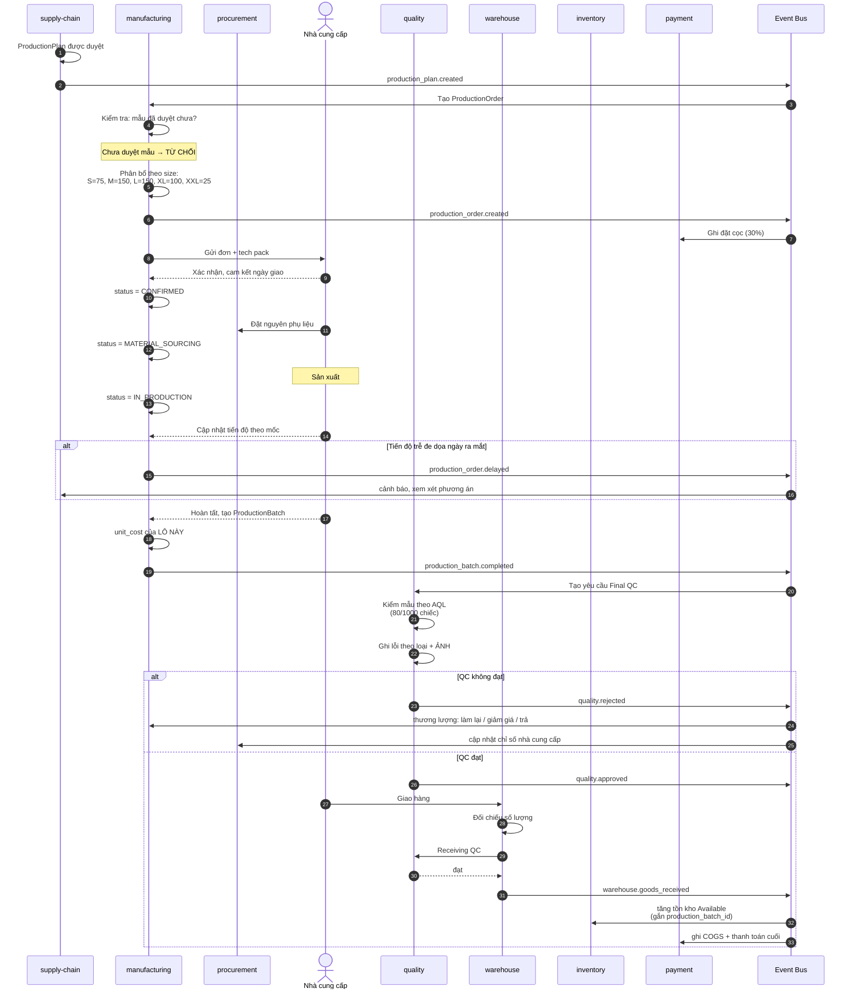
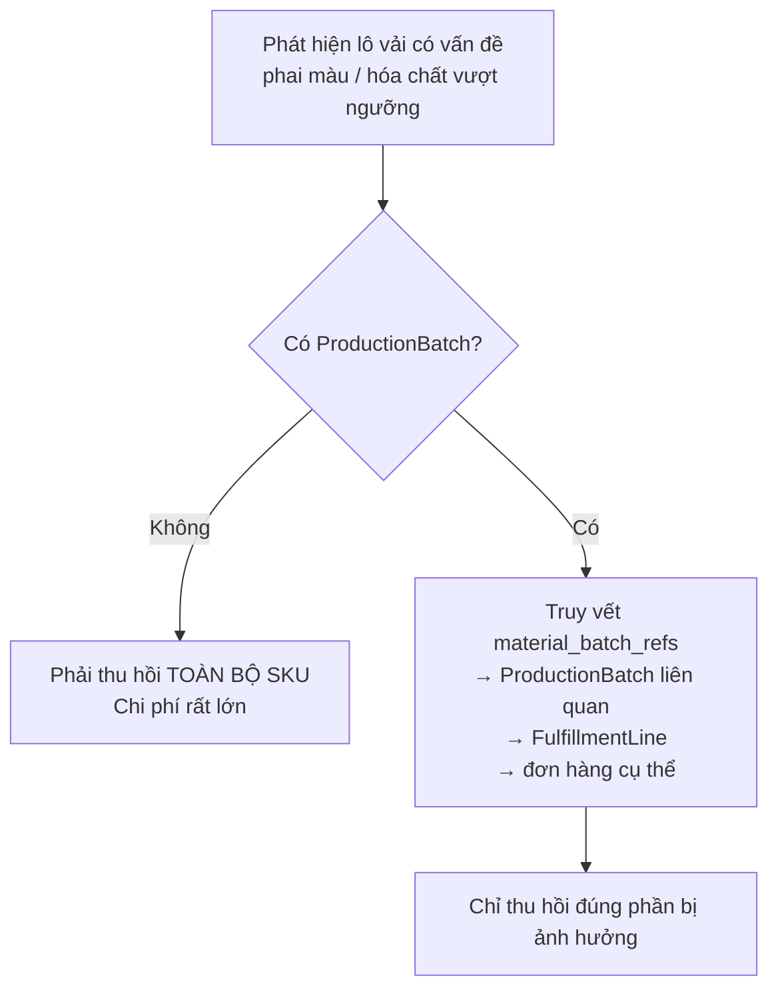
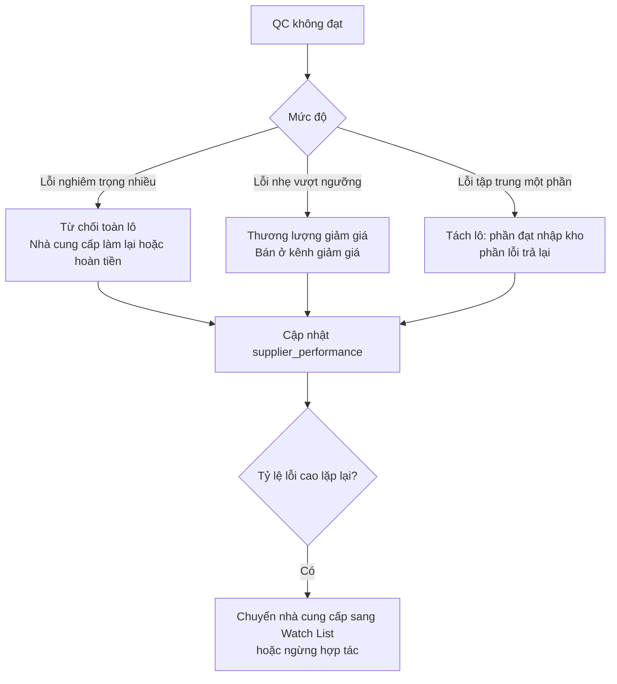

# Luồng: Đặt sản xuất và kiểm định

## 1. Sequence diagram



---

## 2. Phân biệt Purchase Order và Production Order

```text
Purchase Order (procurement):
    Mua hàng CÓ SẴN
    Đặt → Giao → Nhập kho → Kiểm → Bán
    Lead time: 2–4 tuần

Production Order (manufacturing):
    Đặt SẢN XUẤT theo thiết kế của nền tảng
    Tech pack → Mẫu → Duyệt → Nguyên liệu → Sản xuất
    → QC xưởng → Giao → Nhập kho → QC → Bán
    Lead time: 6–12 tuần
```

Gộp chung hai khái niệm sẽ mất khả năng quản lý các bước riêng của sản xuất (mẫu, định mức nguyên liệu, QC nhiều điểm).

---

## 3. ProductionBatch — đơn vị truy vết

```text
ProductionBatch {
    production_order_id
    sku_id
    quantity_produced, quantity_passed_qc, quantity_rejected
    unit_cost              ← GIÁ VỐN CỦA LÔ NÀY
    production_date
    supplier_id
    material_batch_refs[]  ← truy vết nguyên liệu
    certificates[]
}
```

### Vì sao giá vốn theo lô, không theo SKU

```text
Hai lô cùng SKU sản xuất cách nhau 3 tháng:
    - Giá vải đổi
    - Tỷ giá đổi
    - Số lượng đặt khác → đơn giá khác

Lô 1 (tháng 3): unit_cost = 350.000đ
Lô 2 (tháng 6): unit_cost = 385.000đ

Nếu chỉ lưu MỘT giá vốn cho SKU:
    → mọi tính toán biên lợi nhuận đều sai
```

### Kịch bản thu hồi — giá trị lớn nhất của batch



Đây là lý do `FulfillmentLine` có trường `production_batch_id`.

---

## 4. Kiểm định theo AQL

```text
Lô 1.000 chiếc
Cỡ mẫu kiểm:      80 chiếc
Ngưỡng chấp nhận: tối đa 5 lỗi nhẹ, 0 lỗi nghiêm trọng

Phân loại lỗi:
    CRITICAL — không an toàn, không dùng được
    MAJOR    — ảnh hưởng chức năng/thẩm mỹ rõ rệt
    MINOR    — sai lệch nhỏ, khách khó nhận ra

Lỗi thường gặp với thời trang:
    Đường may lỗi · Sai màu so với mẫu · Sai số đo
    Vải lỗi · Phụ kiện lỗi · Nhãn mác sai · Vết bẩn
```

**Ảnh chứng minh bắt buộc** với mọi lỗi — đây là bằng chứng khi thương lượng với nhà cung cấp.

---

## 5. Xử lý khi QC không đạt



**Hệ quả tiến độ:** lô bị từ chối làm chậm 3–6 tuần. Với hàng theo mùa, đây có thể là mất cả mùa bán. Vì vậy `inline QC` (kiểm trong quá trình sản xuất) quan trọng — phát hiện sớm rẻ hơn nhiều.

---

## 6. Theo dõi tiến độ và cảnh báo

```text
Mốc theo dõi:
    Xác nhận đơn          → dự kiến +3 ngày
    Nguyên liệu sẵn sàng  → dự kiến +3 tuần
    Bắt đầu sản xuất      → dự kiến +4 tuần
    Hoàn tất sản xuất     → dự kiến +8 tuần
    QC đạt                → dự kiến +9 tuần
    Giao hàng             → dự kiến +10 tuần

Cảnh báo khi:
    - Mốc trễ > 1 tuần
    - Tổng tiến độ đe dọa ngày ra mắt bộ sưu tập
```

**Vì sao quan trọng với thời trang:** hàng về trễ mùa mất phần lớn giá trị. Cảnh báo sớm cho phép: đẩy nhanh sản xuất, tìm nguồn thay thế, hoặc điều chỉnh kế hoạch marketing.

---

## 7. Dòng tiền với nhà cung cấp

```text
Đặt cọc (30%)      → khi đặt đơn sản xuất
Thanh toán giữa    → khi hoàn tất nguyên liệu (nếu có thỏa thuận)
Thanh toán cuối    → sau khi giao hàng và QC đạt

Ghi sổ:
    Đặt cọc:  DEBIT  SUPPLIER_PREPAYMENT
              CREDIT PLATFORM_CASH

    Nhập kho: DEBIT  INVENTORY_ASSET
              CREDIT SUPPLIER_PAYABLE
              (giá trị = quantity × unit_cost của lô)
```

**Nguyên tắc:** thanh toán cuối **sau khi QC đạt**, không phải sau khi giao hàng. Đây là đòn bẩy đảm bảo chất lượng.

---

## 8. Điểm cần giám sát

| Chỉ báo | Mục tiêu |
|---|---|
| On-time delivery rate | > 90% |
| Quality pass rate (lần đầu) | > 95% |
| Defect rate | Theo dõi theo nhà cung cấp |
| Cost variance | < 10% |
| Đơn sản xuất trễ đe dọa ngày ra mắt | Cảnh báo ngay |
| Lô không có ProductionBatch | 0 |
| Lô nhập kho chưa qua QC | 0 (nghiêm trọng) |

---

## 9. Tài liệu liên quan

- [own-brand-product.md](own-brand-product.md) — bước trước
- [replenishment.md](replenishment.md) — tái sản xuất
- [../04-modules/manufacturing.md](../04-modules/manufacturing.md), [../04-modules/quality.md](../04-modules/quality.md)
- [../01-business/supplier.md](../01-business/supplier.md)
