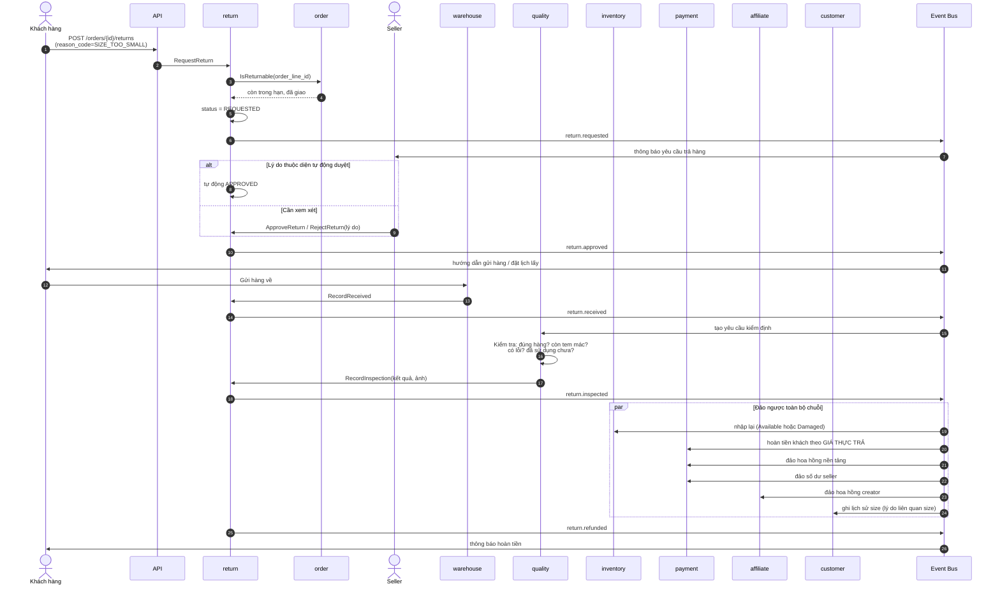
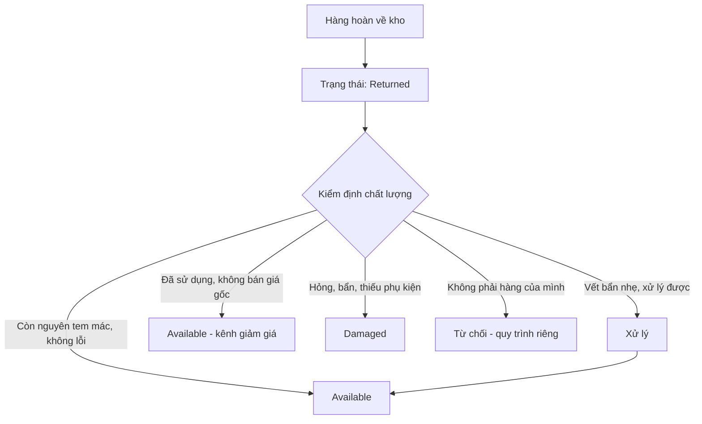
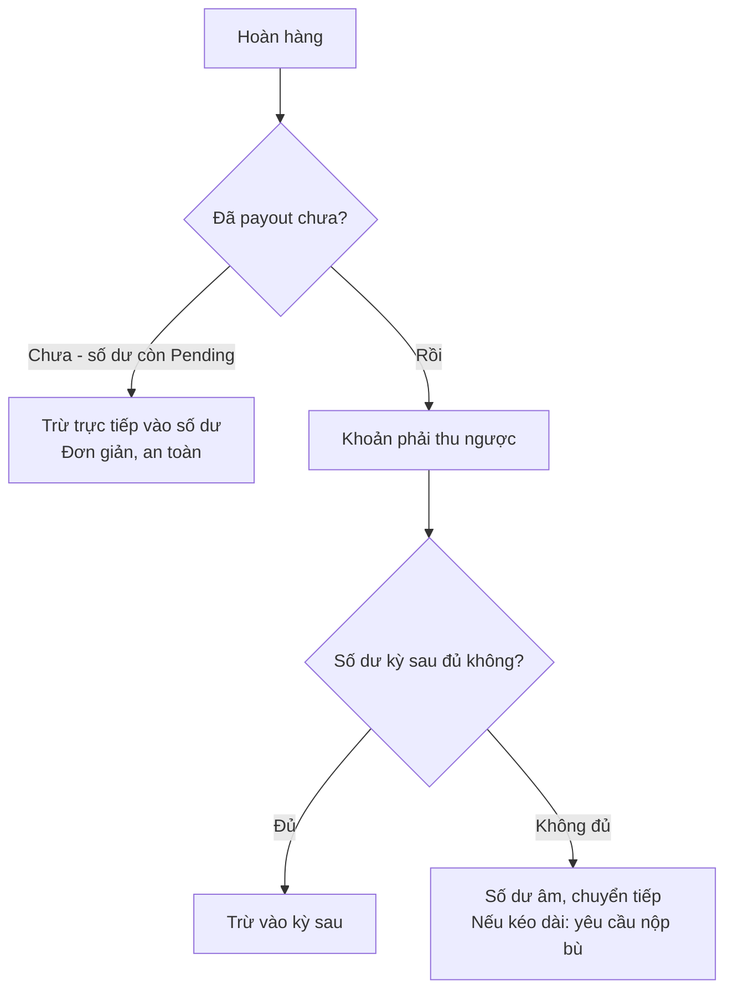
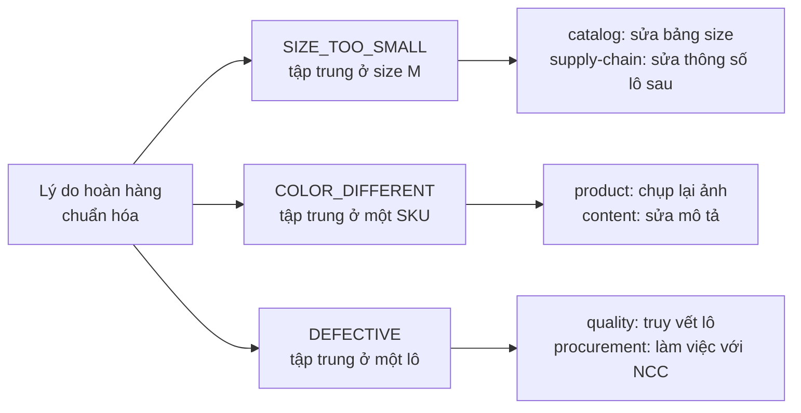

# Luồng: Trả hàng

## 1. Vì sao luồng này quan trọng đặc biệt

Tỷ lệ hoàn hàng ngành thời trang cao hơn hẳn các ngành khác — khách không thử được trước khi mua.

**Hệ quả:** trả hàng **không phải trường hợp ngoại lệ**, mà là **luồng chính** cần thiết kế kỹ ngay từ đầu.

---

## 2. Sequence diagram — luồng đầy đủ



---

## 3. Lý do hoàn hàng — chuẩn hóa bắt buộc

```text
SIZE_TOO_SMALL · SIZE_TOO_LARGE
NOT_AS_DESCRIBED · COLOR_DIFFERENT
QUALITY_ISSUE · DEFECTIVE
WRONG_ITEM_SENT · DAMAGED_IN_TRANSIT
CHANGED_MIND · LATE_DELIVERY
```

### Vì sao chuẩn hóa, không dùng văn bản tự do

Lý do hoàn **quyết định dòng tiền** và **hành động khắc phục**:

| Lý do | Bên chịu chi phí | Hành động khắc phục |
|---|---|---|
| `DEFECTIVE`, `WRONG_ITEM_SENT` | Seller/nền tảng | **Truy vết lô sản xuất**, làm việc với nhà cung cấp |
| `NOT_AS_DESCRIBED`, `COLOR_DIFFERENT` | Seller | Sửa nội dung, cảnh cáo seller |
| `SIZE_TOO_SMALL/LARGE` | Theo chính sách | **Sửa bảng size**, cập nhật hồ sơ khách |
| `DAMAGED_IN_TRANSIT` | Đơn vị vận chuyển | Khiếu nại đối tác |
| `CHANGED_MIND` | Khách (thường) | Không hành động |

Nếu lý do là văn bản tự do, không phân tích được và không ra được quyết định nào.

---

## 4. Quy tắc nhập lại kho



**Quy tắc bắt buộc:** hàng hoàn **không bao giờ** tự động cộng vào `Available`.

```text
Vi phạm quy tắc này → bán lại hàng hỏng cho khách khác
→ thiệt hại uy tín lớn hơn nhiều giá trị món hàng
```

**Trường hợp `Từ chối`:** khách gửi trả sai hàng (cố ý hoặc nhầm lẫn). Cần quy trình riêng và bằng chứng ảnh.

---

## 5. Chuỗi đảo ngược tài chính — phải đủ

```text
Hoàn một dòng hàng 301.000đ (đã áp giảm giá 10%, thực trả 270.900đ):

1. Hoàn tiền khách:        270.900đ  ← GIÁ THỰC TRẢ, không phải giá niêm yết
2. Đảo hoa hồng nền tảng:  −32.508đ
3. Đảo số dư seller:      −238.392đ
4. Đảo hoa hồng creator:   −13.545đ
5. Giải phóng lượt dùng mã giảm giá
6. Thu hồi điểm thưởng đã tích
7. Nhập lại tồn kho (sau kiểm định)
8. Ghi lịch sử size vào hồ sơ khách
```

### Điểm dễ sai nhất: hoàn theo giá thực trả

```text
Đơn: 3 món, tổng 500.000đ, giảm 50.000đ (10%)
    Món A: 200.000đ → giảm 20.000đ → thực trả 180.000đ
    Món B: 200.000đ → giảm 20.000đ → thực trả 180.000đ
    Món C: 100.000đ → giảm 10.000đ → thực trả  90.000đ

Khách trả món C:
    SAI:  hoàn 100.000đ  (giá niêm yết)
    ĐÚNG: hoàn  90.000đ  (giá thực trả)
```

Vì vậy giảm giá phải được **phân bổ theo tỷ lệ xuống từng dòng hàng và lưu lại** ngay khi đặt hàng. Xem [../04-modules/promotion.md](../04-modules/promotion.md) mục 8.

---

## 6. Xử lý khi đã chi trả cho seller/creator



**Cơ chế phòng ngừa chính:** chỉ chi trả **sau khi hết hạn đổi trả**. Nhờ đó phần lớn trường hợp hoàn hàng rơi vào nhánh C — đơn giản và an toàn.

---

## 7. Vòng phản hồi cải thiện sản phẩm

Đây là giá trị chiến lược thường bị bỏ qua của module return.



**Ví dụ cụ thể:** nếu 30% khách mua size M trả lại với lý do "chật", đó không phải vấn đề của từng khách — đó là **bảng size sai** hoặc **form dáng lô đó bị lệch**. Dữ liệu chuẩn hóa cho phép phát hiện điều này.

---

## 8. Điểm cần giám sát

| Chỉ báo | Ngưỡng |
|---|---|
| Tỷ lệ hoàn hàng tổng | < 20% |
| Tỷ lệ hoàn do size | Theo dõi để sửa bảng size |
| Tỷ lệ hoàn theo seller | > 5% do mô tả sai → cảnh cáo |
| Tỷ lệ hoàn theo nội dung | Cao bất thường → rà soát nội dung |
| Thời gian xử lý hoàn tiền | < 3 ngày sau khi kiểm định |
| Hàng hoàn nhập lại không qua QC | 0 (nghiêm trọng) |
| Chuỗi đảo ngược không đủ | 0 (nghiêm trọng) |

---

## 9. Tài liệu liên quan

- [../04-modules/return.md](../04-modules/return.md)
- [../04-modules/quality.md](../04-modules/quality.md)
- [../01-business/kpi.md](../01-business/kpi.md) mục 3
